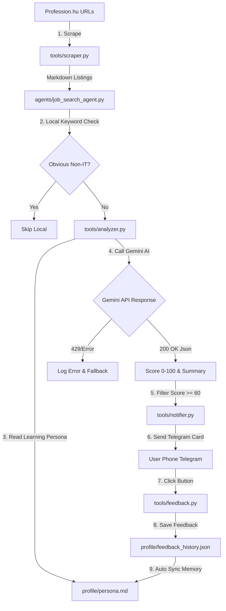

# 🛠️ Job Hunter Architecture Sitemap & Diagnostic Guide

Ez a dokumentum lépésről lépésre bemutatja a rendszer pontos felépítését, az ellenőrzési pontokat és a hibadiagnosztikai parancsokat.

---

## 1. 🏗️ Rendszerarchitektúra és Adatáramlási Térkép



---

## 2. 🔍 Ellenőrzési Pontok és Diagnosztikai Fájlok

| Komponens | Elsődleges Fájl | Mit Ellenőriz? | Hibajelenség / Diagnosztika |
| :--- | :--- | :--- | :--- |
| **1. Web Scraper** | [tools/scraper.py](file:///srv/projects/job-searcher/tools/scraper.py) | Profession.hu HTML kinyerés és hirdetés URL illesztés | Ha 0 hirdetést talál, a Firecrawl API vagy az URL pattern hibádzik. |
| **2. AI Elemző** | [tools/analyzer.py](file:///srv/projects/job-searcher/tools/analyzer.py) | Gemini API hívás, JSON parse, kvótakezelés | Ha 429 ResourceExhausted lép fel, az API kulcs ingyenes fiókhoz van kötve. |
| **3. Tanuló Persona** | [profile/persona.md](file:///srv/projects/job-searcher/profile/persona.md) | Célszemély profil és megtanult emberi szabályok | Az AI innen olvassa be a 20+ év tapasztalatot és a visszajelzéseidet. |
| **4. Telegram Notifier** | [tools/notifier.py](file:///srv/projects/job-searcher/tools/notifier.py) | 5-opciós interaktív gombsor és üzenetküldés | Ellenőrzi a Bot Token és Chat ID érvényességét. |
| **5. Feedback Memory** | [tools/feedback.py](file:///srv/projects/job-searcher/tools/feedback.py) | Telefonos gombkattintások rögzítése | Az elmentett gombnyomásokat automatikusan összefűzi a `persona.md`-vel. |

---

## 3. 🧪 Diagnosztikai Parancsok (Hogyan Ellenőrizd a Rendszert?)

### A. Teljes Automata Tesztszvit Futtatása (21 Unit & Integrációs Teszt)
```bash
python3 -m pytest tests/ -v
```

### B. Gyors Éles Elemzési Diagnosztika (3 Hirdetés Tesztelése Élőben)
Futtasd az alábbi parancsot a terminálban, amely pontról pontra kiírja a scraping, az AI válasz és a Telegram küldés stádiumát:
```bash
python3 -c "
import os, json
from dotenv import load_dotenv
from tools.scraper import JobScraper
from tools.analyzer import JobAnalyzer
from tools.notifier import TelegramNotifier

load_dotenv()
scraper = JobScraper(mock_mode=False)
analyzer = JobAnalyzer(mock_mode=False)
notifier = TelegramNotifier(mock_mode=False)

print('--- 1. SCRAPING ---')
jobs = scraper.scrape_jobs()[:2]
print(f'Kinyerve: {len(jobs)} állás.')

for j in jobs:
    print('\n--- 2. AI ELEMZÉS ---')
    print('Cím:', j['title'])
    res = analyzer.analyze_job(j)
    print('AI Eredmény:', res)
    
    print('\n--- 3. TELEGRAM KÜLDÉS ---')
    if res:
        sent = notifier.send_job_notification(j, res['score'], res['summary'])
        print('Telegram Küldés Sikeres:', sent)
"
```

### C. Folyamatban Lévő Rendszernaplók (Logs) Megtekintése
A rendszer minden futása részletes naplót generál a háttérben:
```bash
cat /home/bj/.gemini/antigravity-cli/brain/06306c6f-d8bc-4531-af8d-77f7daf3c29a/.system_generated/tasks/*.log | tail -n 50
```

---

## 4. 🔑 Google AI Studio $300 Kredit Beállítási Csekklista

Ahhoz, hogy a `gemini-2.5-pro` és `gemini-2.5-flash` ne ütközzön 429-es ingyenes kvótahibába:
1. Nyisd meg a [https://ai.studio/projects](https://ai.studio/projects) oldalt.
2. Válaszd ki a **job-searcher-503608** projektet.
3. Kattints a **Plan & Billing** menüpontra.
4. Győződj meg róla, hogy a $300-os GCP Billing Account hozzá van rendelve a projekthez (Pay-as-you-go / Prepayment mód).
