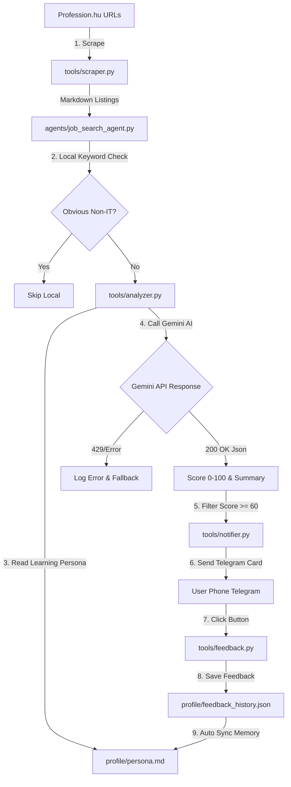

# 🛠️ Job Searcher Architecture Sitemap & Diagnostic Guide

Ez a dokumentum lépésről lépésre bemutatja a **Job Searcher (`job-searcher`)** rendszer pontos felépítését, az ellenőrzési pontokat és a hibadiagnosztikai parancsokat.

---

## 0. ⚙️ Telepítés (Első Futtatás Előtt)

```bash
# 1. Repozitórium klónozása
git clone <repo-url> job-searcher
cd job-searcher

# 2. Virtuális környezet létrehozása és aktiválása
python3 -m venv .venv
source .venv/bin/activate

# 3. Függőségek telepítése
pip install -r requirements.txt

# 4. Környezeti változók beállítása
cp .env.example .env
# ...majd töltsd ki a .env-et: GEMINI_API_KEY, FIRECRAWL_API_KEY,
# TELEGRAM_BOT_TOKEN, TELEGRAM_CHAT_ID, GCP_PROJECT_ID

# 5. Tesztek futtatása (MOCK_MODE-ban, API kulcs nélkül is működik)
python3 -m pytest tests/ -v
```

**Fontos:** a `systemd/job-searcher.service` és a lenti cron példa is a `.venv/bin/python3`-at
hívja, nem a rendszer Python-ját — a rendszer Python-nak nincsenek telepítve a projekt
függőségei (firecrawl-py, google-genai, python-telegram-bot stb.), így `ExecStart=/usr/bin/python3 ...`
azonnal `ModuleNotFoundError`-ral elszállna éles telepítés esetén.

---

## 1. 🏗️ Rendszerarchitektúra és Adatáramlási Térkép



---

## 2. 🔍 Ellenőrzési Pontok és Diagnosztikai Fájlok

| Komponens | Elsődleges Fájl | Mit Ellenőriz? | Hibajelenség / Diagnosztika |
| :--- | :--- | :--- | :--- |
| **1. Web Scraper** | [tools/scraper.py](file:///srv/projects/job-searcher/tools/scraper.py) | Profession.hu HTML kinyerés és hirdetés URL illesztés | Ha 0 hirdetést talál, a Firecrawl API vagy az URL pattern hibádzik. |
| **2. AI Elemző** | [tools/analyzer.py](file:///srv/projects/job-searcher/tools/analyzer.py) | Gemini API hívás, JSON parse, kvótakezelés | Ha 429 ResourceExhausted lép fel, az API kulcs ingyenes fiókhoz van kötve. |
| **3. Tanuló Persona** | [profile/persona.md](file:///srv/projects/job-searcher/profile/persona.md) | Célszemély profil és megtanult emberi szabályok | Az AI innen olvassa be a 20+ év tapasztalatot és a visszajelzéseidet. |
| **4. Telegram Notifier** | [tools/notifier.py](file:///srv/projects/job-searcher/tools/notifier.py) | 5-opciós interaktív gombsor és üzenetküldés | Ellenőrzi a Bot Token és Chat ID érvényességét. |
| **5. Feedback Memory** | [tools/feedback.py](file:///srv/projects/job-searcher/tools/feedback.py) | Telefonos gombkattintások rögzítése | Az elmentett gombnyomásokat automatikusan összefűzi a `persona.md`-vel. |

---

## 3. 🧪 Diagnosztikai Parancsok (Hogyan Ellenőrizd a Rendszert?)

### A. Teljes Automata Tesztszvit Futtatása (21 Unit & Integrációs Teszt)
```bash
python3 -m pytest tests/ -v
```

### B. Gyors Éles Elemzési Diagnosztika (3 Hirdetés Tesztelése Élőben)
Futtasd az alábbi parancsot a terminálban, amely pontról pontra kiírja a scraping, az AI válasz és a Telegram küldés stádiumát:
```bash
python3 -c "
import os, json
from dotenv import load_dotenv
from tools.scraper import JobScraper
from tools.analyzer import JobAnalyzer
from tools.notifier import TelegramNotifier

load_dotenv()
scraper = JobScraper(mock_mode=False)
analyzer = JobAnalyzer(mock_mode=False)
notifier = TelegramNotifier(mock_mode=False)

print('--- 1. SCRAPING ---')
jobs = scraper.scrape_jobs()[:2]
print(f'Kinyerve: {len(jobs)} állás.')

for j in jobs:
    print('\n--- 2. AI ELEMZÉS ---')
    print('Cím:', j['title'])
    res = analyzer.analyze_job(j)
    print('AI Eredmény:', res)
    
    print('\n--- 3. TELEGRAM KÜLDÉS ---')
    if res:
        sent = notifier.send_job_notification(j, res['score'], res['summary'])
        print('Telegram Küldés Sikeres:', sent)
"
```

### C. Folyamatban Lévő Rendszernaplók (Logs) Megtekintése
A rendszer minden futása részletes naplót generál a háttérben:
```bash
cat /home/bj/.gemini/antigravity-cli/brain/06306c6f-d8bc-4531-af8d-77f7daf3c29a/.system_generated/tasks/*.log | tail -n 50
```

---

## 5. 🖥️ GCP e2-micro VM (Always Free Tier) Architektúra & Üzemeltetés

A **Job Searcher (`job-searcher`)** kódalapja kifejezetten úgy lett felépítve, hogy a Google Cloud Platform ingyenes **e2-micro VM (1 vCPU, 1 GB RAM)** példányán 0 Ft költséggel, maximális stabilitással fusson.

### 🟢 Miért ideális ez az architektúra e2-micro gépre?
- **Alacsony Memória-lábnyom (~30-60 MB RAM):** A modulok nem használnak nehézsúlyú keretrendszereket. A szekvenciális pipeline futása során a memóriaigény messze 100 MB alatt marad, így a VM 1 GB RAM-ját nem lépi túl.
- **Kíméletes CPU Kredit Használat:** A hívások közötti biztonsági szünetek kímélik a burstable CPU-t, megelőzve a teljesítménykorlátozást (throttling).
- **Determinált Memóriahasználat:** A `MAX_JOBS_LIMIT` korlát garantálja,hogy a feldolgozott adatmennyiség kiszámítható marad.

### ⚙️ Ajánlott GCP e2-micro Beállítások:
1. **Ütemezett cron indítás (0 MB RAM passzív állapotban):** Ne fusson folyamatos daemonként. Állíts be napi 1-2 cron lefutást:
   ```bash
   0 8,17 * * * cd /srv/projects/job-searcher && .venv/bin/python3 main.py >> /var/log/job-searcher.log 2>&1
   ```
2. **4 GB SWAP Konfiguráció (Maximális OOM és Stabilitási Védelem):**
   ```bash
   sudo fallocate -l 4G /swapfile
   sudo chmod 600 /swapfile
   sudo mkswap /swapfile
   sudo swapon /swapfile
   ```
3. **Log Forgatás (Lemezterület védelme):** Állíts be `logrotate`-et vagy journalctl max méretet.
4. **Firestore Free Quota:** A napi mentések és ellenőrzések tökéletesen beleférnek a napi 50,000 ingyenes olvasási és 20,000 írási limitbe.
